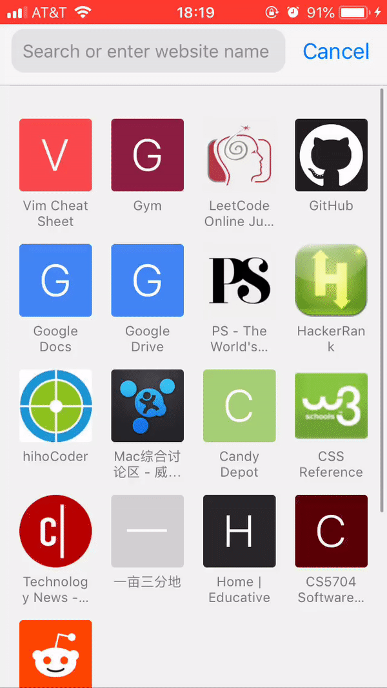

<p align="center">
  
</p>

| I | Ⅱ | Ⅲ | Ⅳ | Ⅴ | Ⅵ | Ⅶ | Ⅷ | Ⅸ | Ⅹ |
| :--------: | :---------: | :---------: | :---------: | :---------: | :---------:| :---------: | :-------: | :-------:| :------:|

# Iphone 捷径库 -- Iphone Shortcut Library. 🔥持续更新中🔥
这是Iphone捷径库，由Apple的 “捷径” app 支持，目的在于收集最好用的捷径脚本，提高生活生产效率。

(This is an Iphone shortcut Library supported by Apple's ```Shortcut``` App, which gathers the best shortcuts for iphone.)


## 如何获得捷径 -- Installation
系统需要是 IOS12 及以上

1. 在Apple应用商店下载 ```捷径``` APP。(Download ```shortcut``` app in Apple Store)

2. 复制捷径库中的捷径链接。 (Copy the shortcut's link in this Library)

3. 在Iphone的Safari中打开。 (Open the link with ```safari``` on Iphone)

4. 点击```获取捷径```。 (Get the shortcut.)

或

1. 在Apple应用商店下载 ```捷径``` APP。(Download ```shortcut``` app in Apple Store)

2. 用手机safari浏览本网页 (Open this site with Iphone safari)

3. 点击捷径链接。 (Click on the shortcuts' links)


## 捷径库 -- Shortcut Library
### 🏠生活-Life
1. **睡觉勿扰+闹钟**(Sleep) [source](https://owenying.github.io)：
* https://www.icloud.com/shortcuts/ee5292fee3da4f5aaa9e75d41503a34f

2. **午觉倒计时**(Noon snap Timer) [source](https://owenying.github.io)：
* https://www.icloud.com/shortcuts/4953406297c84be79a36c1d39206cc23

3. **生日提醒**(Birthdays) [source](https://www.reddit.com/r/shortcuts/comments/9nucwv/download_a_lot_of_shortcuts_here/)：
* https://www.icloud.com/shortcuts/47b24ac86c5a48249990e298436a5ec4

4. **小费计算器**(Calculate Tip) [source](https://owenying.github.io)：
* https://www.icloud.com/shortcuts/8e6fde6dba6e46d89195adff4251daf3

5. **折扣计算器**(Discount) [source](https://www.reddit.com/r/shortcuts/comments/9mt64i/would_anyone_like_any_of_my_shortcuts/)：
* https://www.icloud.com/shortcuts/604a92bad4494a699ae10e8ee09c6ee4

6. **生存模式**(Survival Mode) [source](https://www.reddit.com/r/shortcuts/comments/9mt64i/would_anyone_like_any_of_my_shortcuts/)：
* https://www.icloud.com/shortcuts/edce60f1e3b0484fb58d0f1a39ff228a

7. **生成Wifi二维码**(WiFi QR Scanner) [source](https://www.reddit.com/r/shortcuts/comments/9mt64i/would_anyone_like_any_of_my_shortcuts/)：
* https://www.icloud.com/shortcuts/61b7c5d600b240439b5ae7f56f3db1b2

8. **刷牙计时器**(Brush Teeth Timer) [source](https://www.reddit.com/r/shortcuts/comments/9mt64i/would_anyone_like_any_of_my_shortcuts/)：
* https://www.icloud.com/shortcuts/4f90f9f5961e4d7a9fcb948025f36baf

9. **天数倒计时**(Days Until) [source](https://www.reddit.com/r/shortcuts/comments/9mt64i/would_anyone_like_any_of_my_shortcuts/)：
* https://www.icloud.com/shortcuts/23f9dd645cba4f828c0df178f12a4af9

### 📖学习-Study
1. **Leetcode计时器**(Leetcode Timer) [source](https://owenying.github.io)：
* https://www.icloud.com/shortcuts/b50099d358684f35a7c712b9669d8873

### 🌲效率-Efficiency
1. **Wifi蓝牙开关**(Wi-Fi and Bluetooth Toggle) [source](https://www.reddit.com/r/shortcuts/comments/9hb7ey/heres_a_list_of_all_my_shortcuts_so_far_the_ones/)：
* https://www.icloud.com/shortcuts/6112b7815fad40288342fdc4a30e9bc3

### 🏈健身-Health
1. **每日健身报告生成器**(Activity Report) [source](https://www.reddit.com/r/shortcuts/comments/9hb7ey/heres_a_list_of_all_my_shortcuts_so_far_the_ones/)：
*https://www.icloud.com/shortcuts/5437ade3610049dbb4ed7c284ce04148

### 🔧工具-Tools
1. **保存网站中的所有图片**(Save all images of a webpage) [source](https://www.reddit.com/comments/9sh2jt/)：
* https://www.icloud.com/shortcuts/f8a9449a869248fb98ef144657190728

2. **网页视频下载器**(Video Downloader) [source](https://www.reddit.com/comments/9i2517/)：
* https://www.icloud.com/shortcuts/939a092d1d9e48e19cf84cd5f4479c1d

3. **Live Photo转GIF**(Burst Photo to GIF) [source](https://www.reddit.com/r/shortcuts/comments/9nucwv/download_a_lot_of_shortcuts_here/)：
* https://www.icloud.com/shortcuts/2bc76ebbe77648e8a192a07e65b5b5d9

4. **清空剪贴板**(Clear Clipboard) [source](https://www.reddit.com/r/shortcuts/comments/9nucwv/download_a_lot_of_shortcuts_here/)：
* https://www.icloud.com/shortcuts/b154e4ef774e44fdae09524cd982cf26

5. **剪贴板修改器**(Clipboard Modifier) [source](https://www.reddit.com/r/shortcuts/comments/9nucwv/download_a_lot_of_shortcuts_here/)：
* https://www.icloud.com/shortcuts/fbb63fd191874d369b5b38fc089a97d7

6. **180度旋转网页**(Flip Website 180°) [source](https://www.reddit.com/r/shortcuts/comments/9nucwv/download_a_lot_of_shortcuts_here/)：
* https://www.icloud.com/shortcuts/00e74296e3d74b03a1319833969ec694

7. **剪裁图片**(Image Cropper) [source](https://www.reddit.com/r/shortcuts/comments/9nucwv/download_a_lot_of_shortcuts_here/)：
* https://www.icloud.com/shortcuts/d2ae87b7219b4735a3a81d4f811e5f14

8. **改变图片大小**(Image Resizer) [source](https://www.reddit.com/r/shortcuts/comments/9nucwv/download_a_lot_of_shortcuts_here/)：
* https://www.icloud.com/shortcuts/a62a1ce3fbee42c39da385c0eb93a214

9. **密码生成器**(Password Generator) [source](https://www.reddit.com/r/shortcuts/comments/9nucwv/download_a_lot_of_shortcuts_here/)：
* https://www.icloud.com/shortcuts/70e229993a4b4ca686da7f5d5da52a24

10. **多图转GIF**(Photos > GIF) [source](https://www.reddit.com/r/shortcuts/comments/9nucwv/download_a_lot_of_shortcuts_here/)：
* https://www.icloud.com/shortcuts/f13861cf39ac437c9d0dbaa8b686c87c

11. **二维码生成**(QR Everything) [source](https://www.reddit.com/r/shortcuts/comments/9nucwv/download_a_lot_of_shortcuts_here/)：
* https://www.icloud.com/shortcuts/94aee79b225c461abbc081f315d85eb5

12. **随机数产生器**(Random Number Generator) [source](https://www.reddit.com/r/shortcuts/comments/9nucwv/download_a_lot_of_shortcuts_here/)：
* https://www.icloud.com/shortcuts/f4b271fba0cb490a81d5df54fa1d48db

13. **YouTube下载器**(YouTube Download) [source](https://www.reddit.com/r/shortcuts/comments/9hb7ey/heres_a_list_of_all_my_shortcuts_so_far_the_ones/)：
*https://www.icloud.com/shortcuts/beda7406ce4747d8a29679daf1d45180


### 🚗交通-Trafic
### 🎩娱乐-Entertainment
1. **心情电池**(Mood Battery) [source](https://www.reddit.com/comments/9vjal1/)：
* https://www.icloud.com/shortcuts/837ecd69085347cd95ecb59723aaad3a

2. **听歌识曲**(Song Identifier) [source](https://www.reddit.com/r/shortcuts/comments/9nucwv/download_a_lot_of_shortcuts_here/)：
* https://www.icloud.com/shortcuts/9ba0998d8bf4420296b94258ccb630cd

3. **决定生成器**(Decision) [source](https://www.reddit.com/r/shortcuts/comments/9hb7ey/heres_a_list_of_all_my_shortcuts_so_far_the_ones/)：
* https://www.icloud.com/shortcuts/6a2690bbaf6f4d478524d2556523054b

4. **掷硬币**(Flip A Coin) [source](https://www.reddit.com/r/shortcuts/comments/9hb7ey/heres_a_list_of_all_my_shortcuts_so_far_the_ones/)：
* https://www.icloud.com/shortcuts/0ec8fb4002294b159c7a4505b58d53be

## 示例 -- Examples



## 如何贡献本仓库 -- Contributing
非常欢迎大家分享自己的```捷径```，可将```分享链接+作者```发送到邮箱```ytc@vt.edu```， 或者```Fork```本仓库。

We are welcome to any kind of shortcuts you want to share.  Please send your ```sharelink+author``` to ```ytc@vt.edu```, or
```Fork```this repo to contribute.


## Built with amazing technologies
[Apple](https://www.apple.com)

[Apple Shortcut](https://support.apple.com/guide/shortcuts/welcome/ios)
